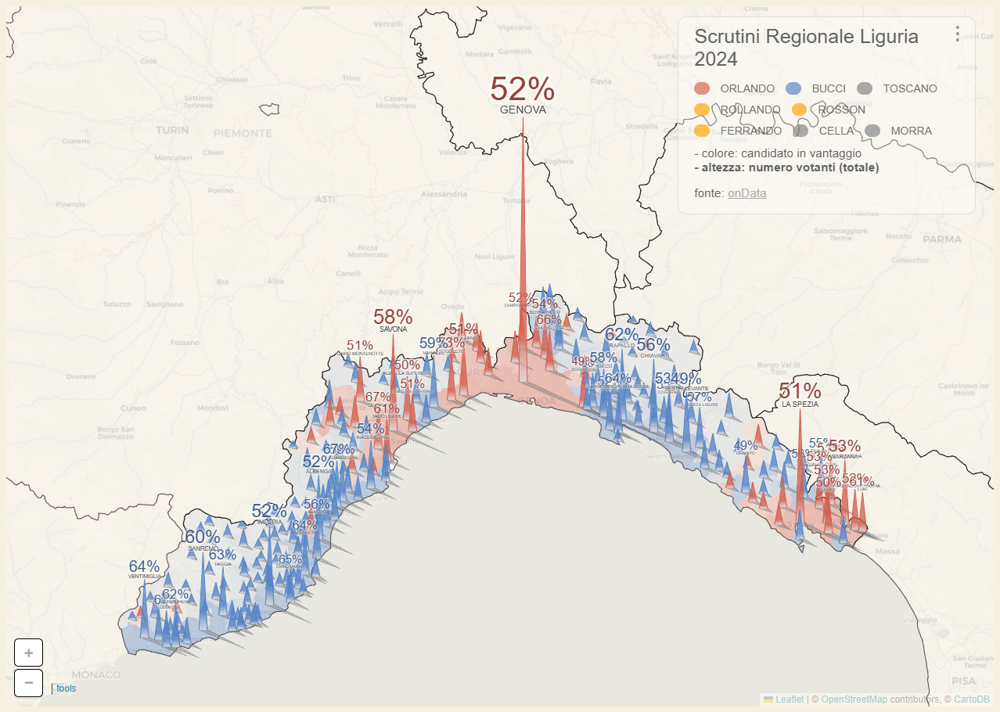
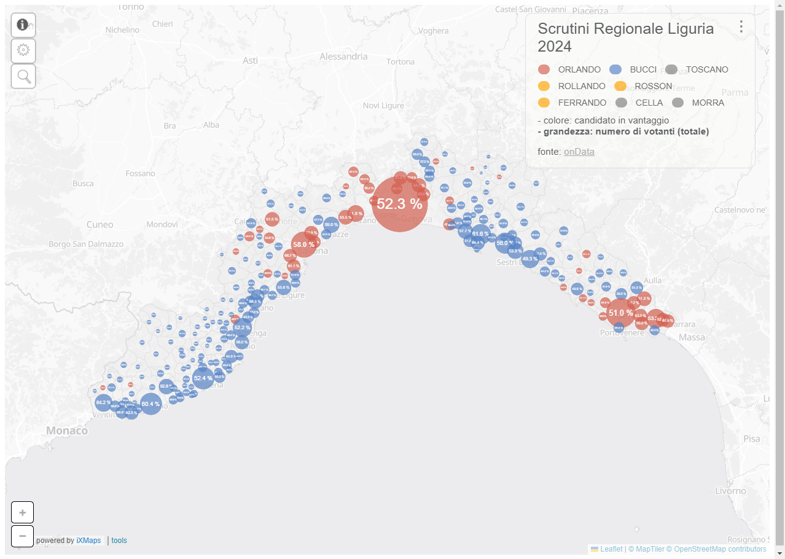

 

# Dati elezioni regionali in Liguria 2024

Li estraiamo perché su [Eligendo](https://elezioni.interno.gov.it/risultati/20241027/regionali/votanti/italia/07), il sito ufficiale del Ministero dell'Interno, non è possibile scaricare in un click un singolo dataset con i dati di dettaglio, ma è necessario fare diversi export. Inoltre nei CSV esportati ci sono delle problematicità che abbiamo descritto [qui](https://x.com/ondatait/status/1850497807481721189).

## Se usi questi dati

Questi dati sono rilasciati con licenza [CC-BY 4.0](https://creativecommons.org/licenses/by/4.0/deed.it). Sei libero di condividere, modificare e utilizzare questi dati per qualsiasi scopo, anche commerciale, a **condizione di citare la fonte**.

Fallo in questo modo:

> Dati resi disponibili dall'[associazione onData](https://github.com/ondata/elezioni_regionali_liguria_2024). Fonte: Ministero dell'Interno

## Dati

### Affluenza

I dati sull'affluenza sono raccolti nel file CSV [`affluenza_comuni.csv`](dati/affluenza_comuni.csv).

Il separatore dei decimali è il punto, e la codifica dei caratteri è UTF-8.

La tabella è composta dai seguenti campi:

| **nome_campo** | **descrizione_campo** | **tipo_campo** | **esempio** |
| --- | --- | --- | --- |
| minint_elettorale | Identificativo elettorale del Comune | integer | 1070370010 |
| comune | Nome del comune | string | AIROLE |
| comune_codice | Codice del comune in Eligendo | integer | 10 |
| codice_sezione | Codice della sezione in Eligendo | integer | 1 |
| elettori_totali | Numero totale degli elettori | integer | 262 |
| elettori_maschi | Numero degli elettori maschi | integer | 147 |
| elettori_femmine | Numero delle elettrici femmine | integer | 115 |
| orario | Timestamp della conta dei voti | Data/ora | 20241027120000 |
| votanti | Numero dei votanti | integer | 45 |
| votanti_maschi | Numero dei votanti maschi | integer | 20 |
| votanti_femmine | Numero delle votanti femmine | integer | 25 |
| percentuale_votanti | Percentuale di affluenza alle urne | float | 17.18 |
| percentuale_tornata_precedente | Percentuale di affluenza alle urne nel turno precedente (al momento non presente) | float |  |
| file | Nome del file dei dati (nota interna onData) | string | affluenza_comune_037_0010 |
| com_istat_code | Codice ISTAT del Comune | string | 008001 |

### Scrutini

Abbiamo pubblicato tre tabelle in formato CSV, con taglio comunale:

- [`scrutini_comuni_principale.csv`](dati/scrutini_comuni_principale.csv), in cui per ogni Comune sono presenti dei valori di insieme come le schede bianche (campo `int_sk_bianche`), le nulle (campo `int_sk_nulle`), ecc.. Il nome del Comune è in `int_desc_com`, mentre il codice Istat del Comune è in `com_istat_code`.
- [`scrutini_comuni_candidati.csv`](dati/scrutini_comuni_candidati.csv), in cui per ogni Comune sono riportati i dati sulle persone che si sono candidate alla presidenza della Regione Liguria. Il codice Istat del Comune è in `com_istat_code`;
- [`scrutini_comuni_liste.csv`](dati/scrutini_comuni_liste.csv), in cui per ogni Comune sono riportati i dati sulle liste che appoggiano le varie candidature alla presidenza. Il codice Istat del Comune è in `com_istat_code`.

Il separatore dei decimali è il punto, e la codifica dei caratteri è UTF-8.

Ci scusiamo per non riuscire a pubblicare subito una descrizione di dettaglio delle tabelle.

## Chi ha usato questi dati

### Guenter Richter

Grazie [Guenter](https://www.linkedin.com/in/guenter-richter-9b13b4/)!

Scrutini con piramidi proporzionali al numero dei votanti.

Mappa coropletica con l'intensità del colore proporzionale al numero dei votanti per km².

Mappa a bolle con la grandezza proporzionale alla percentuale di votanti.

